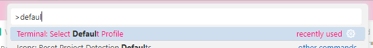
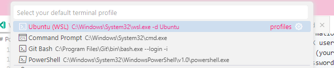
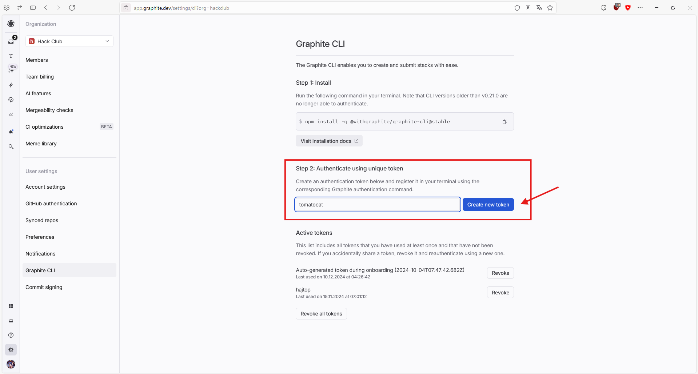
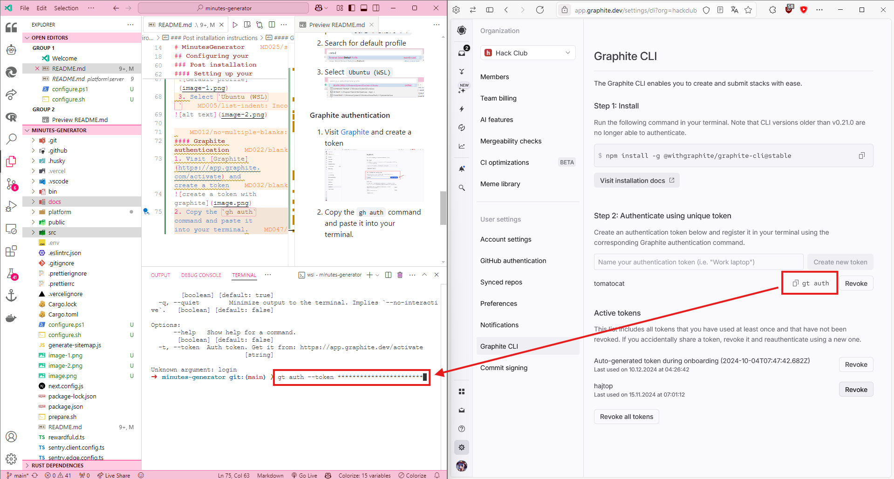

# GovClerkMinutes

Welcome to the monorepo! This repository is divided into two sections: the `govclerk-minutes` for the frontend and everything under `./platform` for the backend.

## Running the Project

To start the development server, run:

```bash
npm run dev
```

> [!NOTE]
> To use the production server instead of the development server, set the environment variable `NEXT_PUBLIC_USE_PROD_SERVER_IN_DEV=1` before running the command above.

## Configuring Your Developer Environment

> [!IMPORTANT]
> Windows developers are advised to use WSL2 for a better development experience.

### Prerequisites

1. **Clone the Repository**:
   ```bash
   git clone https://github.com/GovClerkMinutes/govclerk-minutes.git
   ```

### Windows Prerequisite

1. **Install WSL2**: Run the following script as an Administrator:
   ```bash
   ./configure.cmd
   ```
2. **Restart Your Computer**.
3. **Install and Set Up Ubuntu** (while in the root of this repository):
   ```bash
   wsl --install -d Ubuntu
   ```
   Follow the on-screen instructions to complete the setup.

### Linux and macOS

1. **Run the Configuration Script** to set up your developer environment:
   ```bash
   chmod +x ./configure.sh
   ./configure.sh
   ```

### Post Installation Instructions

#### Setting Up Your Code Editor to Use WSL

> [!NOTE]
> This is only required for Windows users.

1. Open the VSCode command palette: `Ctrl + Shift + P`.
2. Search for "default profile".
   
3. Select `Ubuntu (WSL)`.
   

#### Graphite Authentication

1. Visit [this link](https://app.graphite.com/activate) and create a token.
   
2. Copy the `gh auth` command and paste it into your terminal:
   ```bash
   gt auth --token <your-token>
   ```
   

#### Setting Up Vercel

1. Run the following command and follow the setup instructions:

   ```bash
   vercel link
   ```

   - **Log in to Vercel**: Select your preferred method.
   - **Set up “govclerk-minutes”**: Confirm the setup for the cloned directory.
   - **Which scope should contain your project?**: Max Sherman's projects
   - **Link to existing project?**: yes
   - **What’s the name of your existing project?**: transcribe-summary

2. Pull the environment variables:
   ```bash
   vercel env pull .env
   ```

Congratulations! You are now ready to start developing on the govclerk-minutes project.
