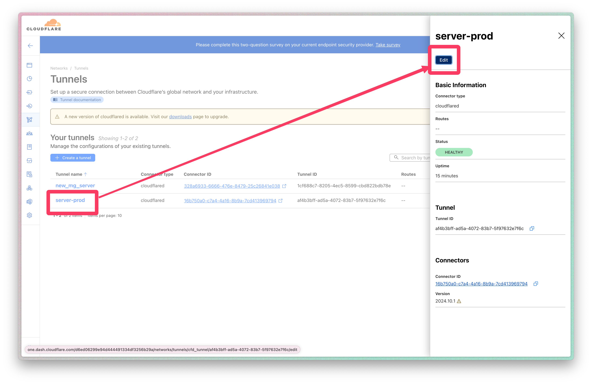
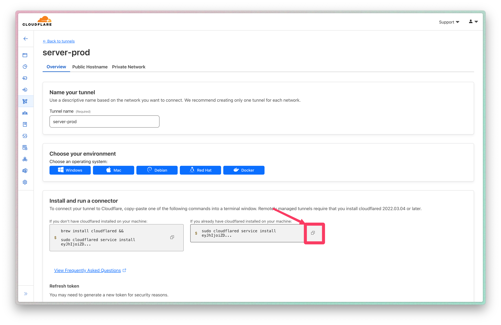
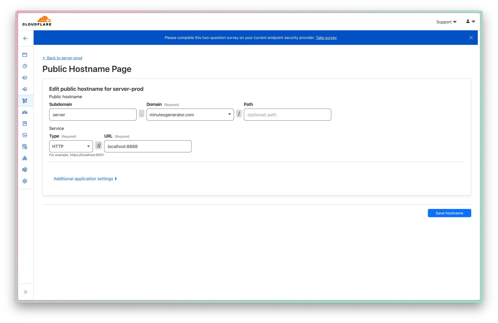

# GovClerkMinutes Backend

## Requirements

- **Install Brew Tap**: `brew tap SergioBenitez/osxct`
- **Install Linux GNU**: `brew install x86_64-unknown-linux-gnu`

## Deployment Process

1. **Set Environment Variables**: Ensure the following are set in your `.env` file:

   - `RUNPOD_API_KEY`: Your Runpod API key for server deployment
   - `CF_API_KEY`: The Cloudflare API key for tunnel management
   - `CF_ACCOUNT_ID`: The Cloudflare Account ID for govclerk-minutes

2. **Deploy the Server**: Use npm for deployment:

   ```bash
   # Basic deployment
   npm run deploy:server

   # Deployment options
   npm run deploy:server -- --restart    # Restart server after deployment
   npm run deploy:server -- --screen     # Attach to screen session after deployment
   npm run deploy:server -- --screen-only # Only attach to screen session (no deployment)
   npm run deploy:server -- --key ~/.ssh/custom_key  # Deploy with custom SSH key
   npm run deploy:server -- --dev        # Enable development environment
   npm run deploy:server -- --pod <pod-id>  # Deploy to specific pod
   ```

   **Deployment Script Actions**:

   - Configures Runpod if not already set
   - Displays available pods for selection if `--pod` is not specified
   - Deploys supporting files including `.env` and server code
   - Optionally restarts the server and/or attaches to a screen session

3. **Manual Server Management**:
   ```bash
   # SSH command shown during deployment
   ssh root@<server-ip> -p <port>
   screen -r                    # View server output
   Ctrl+A, d                   # Detach from screen
   ```

## Setting up a Cloudflare Tunnel

1. **Install Cloudflared on Runpod Server**:

   ```bash
   # Add Cloudflare GPG key
   mkdir -p --mode=0755 /usr/share/keyrings
   curl -fsSL https://pkg.cloudflare.com/cloudflare-main.gpg | tee /usr/share/keyrings/cloudflare-main.gpg >/dev/null

   # Add Cloudflare repo to apt
   echo 'deb [signed-by=/usr/share/keyrings/cloudflare-main.gpg] https://pkg.cloudflare.com/cloudflared jammy main' | tee /etc/apt/sources.list.d/cloudflared.list

   # Install Cloudflared
   apt-get update && apt-get install cloudflared
   ```

2. **Edit Tunnel in Cloudflare Dashboard**:
   

3. **Run Command on Runpod Server**:
   

4. **Verify Cloudflared Status**:

   ```bash
   $ service cloudflared status
   ```

5. **Stop Old Server to Avoid Conflicts**:
   ```bash
   $ cloudflared service uninstall
   ```
   Alternatively, delete the old server to automatically disconnect Cloudflared.

### Creating a New Tunnel

1. **Follow Standard Tunnel Creation Steps**.
2. **Configure Public Hostname**:
   

> [!IMPORTANT]
> Ensure `server.GovClerkMinutes.com` is not occupied by another connector or DNS record.

## Running Tests with ASAN

Anytime you touch unsafe code (like anything using `ffmpeg-sys-next`) you should run ASAN to check there are no memory leaks.

- **Mac**:

  ```bash
  ASAN_OPTIONS="detect_leaks=1:halt_on_error=0" RUSTFLAGS="-Zsanitizer=address" cargo +nightly test -Zbuild-std --target aarch64-apple-darwin
  ```

- **Linux**:
  ```bash
  RUSTFLAGS=-Zsanitizer=address cargo +nightly test -Zbuild-std --target x86_64-unknown-linux-gnu
  ```

**Note**: On Mac, ignore random leaks from system libraries; focus on leaks in your code. Linux does not have this issue.

```
Indirect leak of 8 byte(s) in 1 object(s) allocated from:
    #0 0x000104e592e0 in realloc+0x74 (librustc-nightly_rt.asan.dylib:arm64+0x512e0)
    #1 0x000188597a0c in look_up_class+0x13c (libobjc.A.dylib:arm64+0xba0c)
    #2 0x6505800189b26d70  (<unknown module>)
    #3 0xd73900018c274a7c  (<unknown module>)
    #4 0xa65d800188597100  (<unknown module>)
    #5 0x48090001885f1cb8  (<unknown module>)
    #6 0x1590001885fa974  (<unknown module>)
    #7 0xa03a8001885fa924  (<unknown module>)
    #8 0x24750001885fe694  (<unknown module>)
    #9 0xd36e0001885fab74  (<unknown module>)
    #10 0xf82600018861de38  (<unknown module>)
    #11 0xd7440001885e400c  (<unknown module>)
    #12 0xe6230001885e2ef0  (<unknown module>)
    #13 0xa3337ffffffffffc  (<unknown module>)
```
